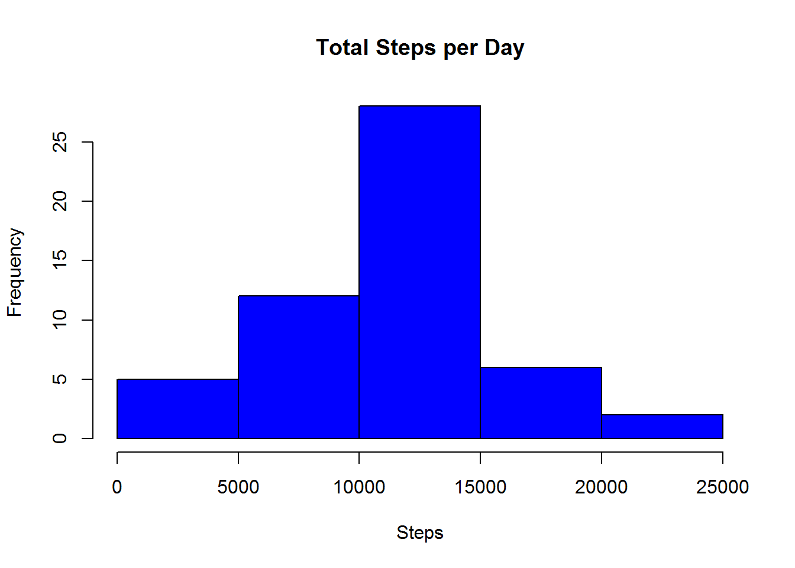
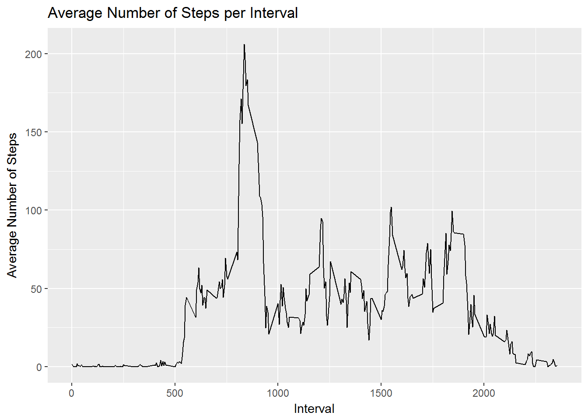
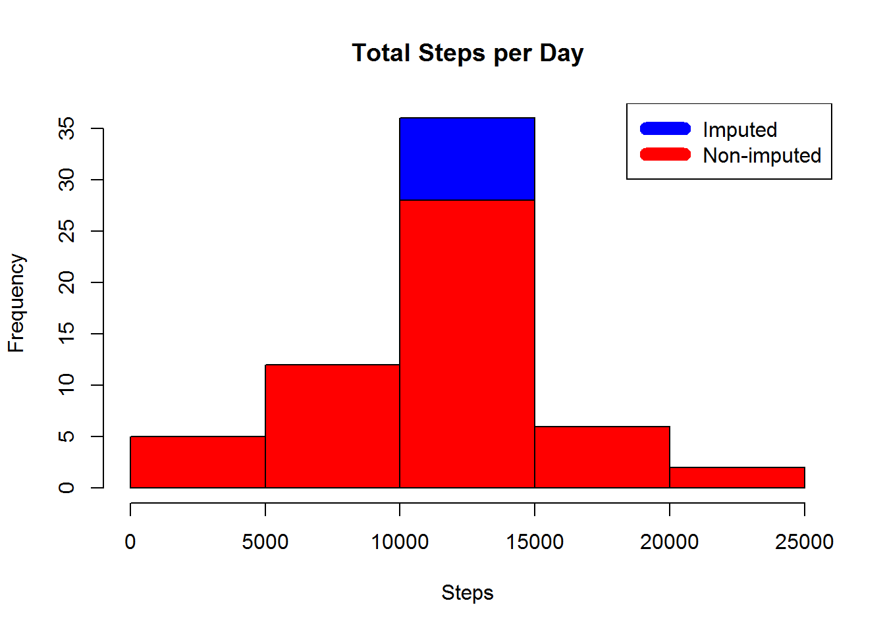
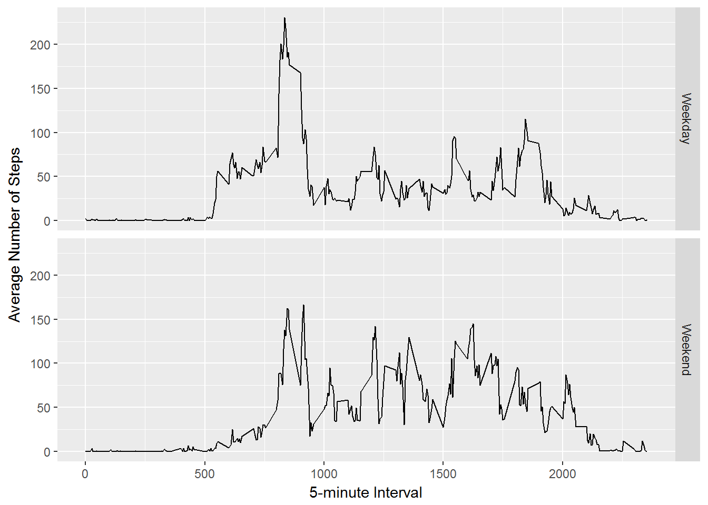

REPRODUCIBLE RESEARCH:PROJECT 1
===============================

The very first thing a person wanting to reproduce this project results
needs to do is to load the data. Please download the data from
<https://d396qusza40orc.cloudfront.net/repdata%2Fdata%2Factivity.zip>,
unzipped the file to the following directory that has to be created in
your PC: `C:\Project_1`

Loading and Preprocessing the Data
==================================

    library(plyr)
    library(ggplot2)

    steps1 <- read.csv("C:/Project_1/activity.csv")
    A1<-na.omit(steps1)

What is the mean of the total number of steps taken per day?
============================================================

Following routine will be used to calculate the total number of steps
taken per day, having for the latter as output an histogram,

    A2 <- aggregate(A1$steps ~ A1$date, FUN=sum, )
    colnames(A2)<- c("date", "steps")
    hist(A2$steps, breaks=5, xlab="Steps", col="blue1", main = "Total Steps per Day")

The total number of steps has as mean and median the following values,

    Prom<-mean(A2$steps)
    Med<-median (A2$steps)
    print(paste0("Mean=", Prom))

    ## [1] "Mean=10766.1886792453"

    print(paste0("Median=", Med))

    ## [1] "Median=10765"

What is the average daily activity pattern?
===========================================

The following routine aims to create a time series plot of the 5-minute
interval (x-axis) and the average number of steps taken, averaged across
all days (y-axis)

    tiempo <- ddply(A1, .(interval), summarize, Avg = mean(steps))
    p <- ggplot(tiempo, aes(x=interval, y=Avg))
    p + geom_line()+xlab("Interval")+ylab("Average Number of Steps")+ggtitle("Average Number of Steps per Interval")

The 5-minute interval, on average across all the days in the dataset,
that contains the maximum number of steps is included below.

    maxSteps <- max(tiempo$Avg)
    max_interval<-tiempo[tiempo$Avg==maxSteps,1]
    print(paste0("The Interval containing the Max. Number of Steps is ", max_interval))

    ## [1] "The Interval containing the Max. Number of Steps is 835"

Imputing missing values
=======================

The following routine calculates and reports the total number of missing
values in the dataset (i.e. the total number of rows with NAs)

    print(paste0("The total number of rows in the dataset with NAs is ", sum(is.na(steps1$steps))))

    ## [1] "The total number of rows in the dataset with NAs is 2304"

The following routine fills in the NAs with the mean of the 5-minute
interval a NA belongs to.

    nas <- is.na(steps1$steps)
    mean_interval <- tapply(steps1$steps, steps1$interval, mean, na.rm=TRUE, simplify=TRUE)
    steps1$steps[nas] <- mean_interval[as.character(steps1$interval[nas])]
    print(paste0("The total number of rows with NAs in the new dataset is ", sum(is.na(steps1$steps))))

    ## [1] "The total number of rows with NAs in the new dataset is 0"

The following routine creates an histogram of the total number of steps
taken each day and calculates and reports the mean and median total
number of steps taken per day.

    A3 <- aggregate(steps1$steps ~ steps1$date, FUN=sum, )
    colnames(A3)<- c("Date", "Steps")
    hist(A3$Steps, breaks=5, xlab="Steps", col="blue", main = "Total Steps per Day")
    hist(A2$steps, breaks=5, xlab="Steps", col="red", main = "Total Steps per Day", add=T)
    legend("topright", c("Imputed", "Non-imputed"), col=c("blue", "red"), lwd=10)

    Prom1<-mean(A3$Steps)
    Med1<-median (A3$Steps)
    print(paste0("The mean of the new dataset is ", Prom1))

    ## [1] "The mean of the new dataset is 10766.1886792453"

    print(paste0("The median of the new data set is ", Med1))

    ## [1] "The median of the new data set is 10766.1886792453"

The mean and median of the new dataset is the same (ie.10,766.19), which
differs from the first dataset (ie. the one with NAs) as for the latter
the mean (ie.10,766.19) and median (ie. 10,765) were different.

Are there differences in activity patterns between weekdays and weekends?
=========================================================================

Following routine creates a new factor variable in the dataset with two
levels - "weekday" and "weekend" indicating whether a given date is a
weekday or weekend day. The routine also creates a panel plot containing
a time series plot of the 5-minute interval (x-axis) and the average
number of steps taken, averaged across all weekday days or weekend days
(y-axis).

    A4<-steps1
    A4$dateType <-  ifelse(as.POSIXlt(A4$date)$wday %in% c(0,6), 'Weekend', 'Weekday')
    A5<- aggregate(steps ~ interval + dateType, data=A4, mean)
    ggplot(A5, aes(interval, steps)) + 
        geom_line() + 
        facet_grid(dateType ~ .) +
        xlab("5-minute Interval") + 
        ylab("Average Number of Steps")

